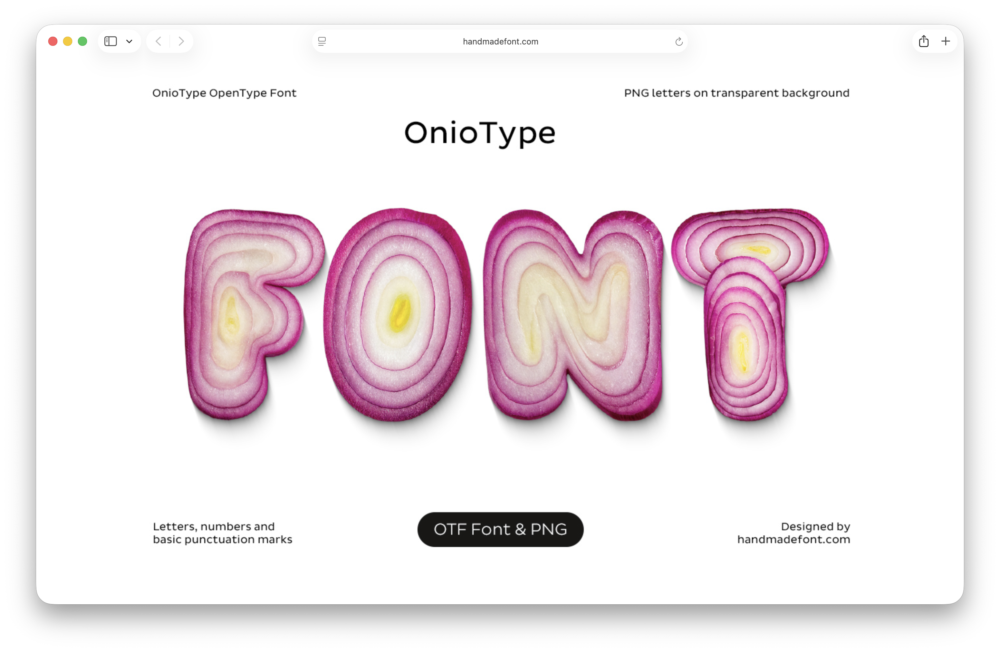
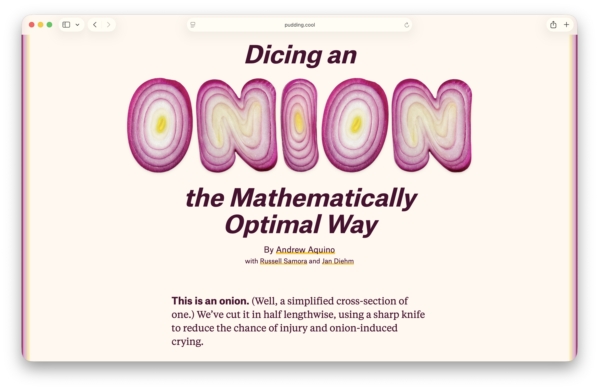

Here’s a small collection of fonts that I find incredibly cool. I would love to use these in my future projects.

## [Les Ouvrières](https://velvetyne.fr/fonts/ouvrieres/)

Ants are considered to be a symbol of hard-working team workers. They signify strength in numbers. I wonder if we could use this font to convey those qualities.

## [OnioType Font](https://handmadefont.com/shop/oniotype-font/)

This is such a fun, delightful font made entirely from red onion slices.

It's been used to great effect in [The Pudding's Onions article](https://pudding.cool/2025/08/onions/), but it's implemented as images rather than text. I wonder if that is because OnioType is, as mentioned on their site, intended for use in applications that support color bitmap fonts. Does the web support color bitmap fonts? I don't know.

## [Alfa Slab One](https://fonts.google.com/specimen/Alfa+Slab+One)

I love the bold design of this font. Google has tagged it as a serif [fat face](https://en.wikipedia.org/wiki/Fat_face). But is it not a slab serif? I mean, it's literally in the name.

## [ChunkFive](https://github.com/theleagueof/chunk)

It's similar to Alfa Slab One, isn't it? I think I prefer Alfa Slab One over Chunk.

