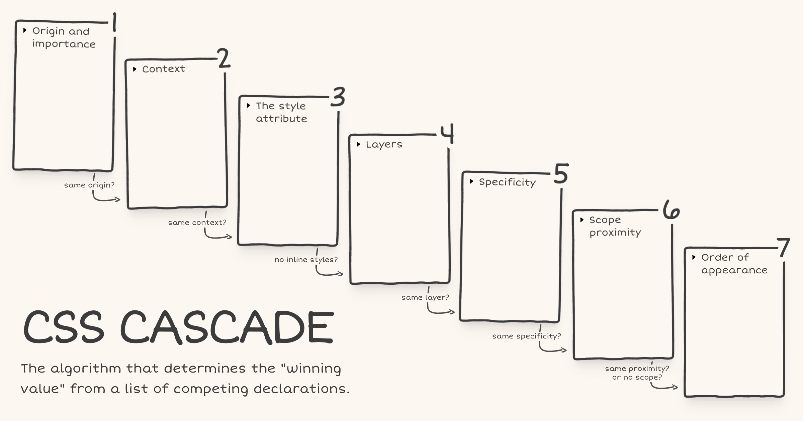

I built a [visual explainer of the CSS Cascade](https://cascade.arpit.codes/), the algorithm that determines the "winning value" from a list of competing declarations.

After Web Day Out 2026, I was checking out [Manuel Matuzović's UA+ stylesheet](https://fokus.dev/tools/uaplus/). Manuel mentioned that he wraps all rules in an anonymous layer to avoid specificity issues. I realised I didn't actually understand how anonymous layers worked, so I went back and re-read [Miriam Suzanne's cascade layers guide on CSS-Tricks](https://css-tricks.com/css-cascade-layers/). I really liked the way Miriam presented the cascade and specifically the order of precedence within each step.

Recently, while learning `@scope`, I had come across a diagram of the cascade in [Bramus' article on `@scope`](https://www.bram.us/2023/08/22/a-quick-introduction-to-css-scope/). I had seen it before in his [CSS Day 2022 talk](https://www.youtube.com/watch?v=zEPXyqj7pEA) as well but this time it stuck with me. The layout just made the cascade click visually.

I wondered if I could combine Bramus' cascade diagram layout with the order of precedence information from Miriam's article. The early CodePen prototype turned out well enough that I decided to polish and publish it.

There are still some things to be done. The website currently fails [WCAG Success Criterion 1.4.4: Resize Text (Level AA)](https://www.w3.org/WAI/WCAG21/Understanding/resize-text.html) under certain conditions. I haven't landed on a fix that works for the design yet. Hit me up if you have any ideas.
